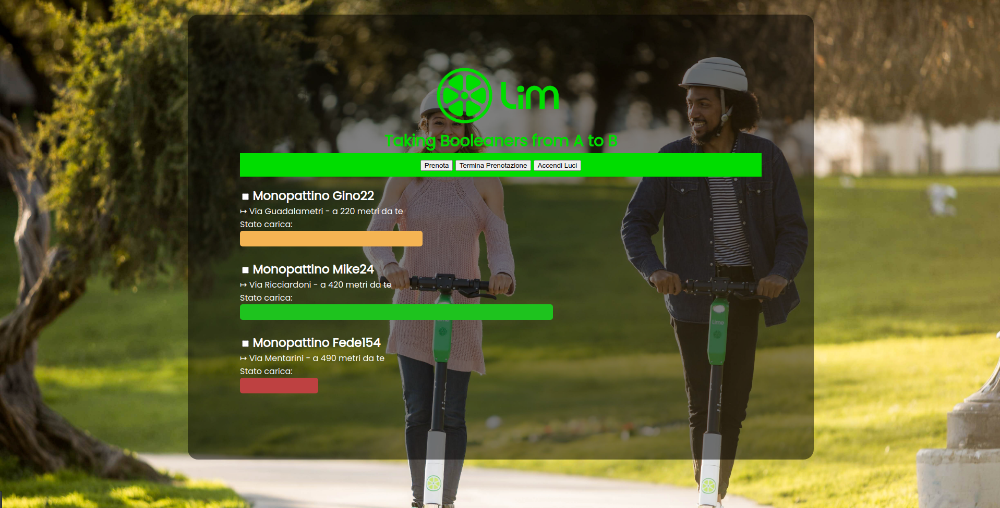

# Taking Booleaners from A to B

This assignment aims at reproducing the following with plain HTML and CSS, as we learned so far.

## Notes for Boolean

In this assignment we used `label` associated with `input` (`checkbox`) as suggested by the IDE, and
I saw it in one of the next chapters.

I also used some variables to avoid repeating colors. This allows for an easy change of a color theme.
